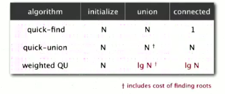
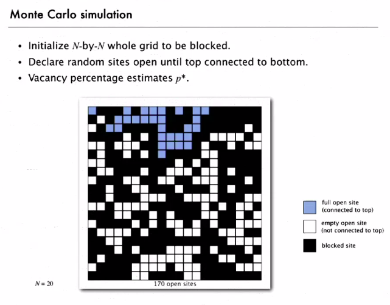

[TOC]

### Union find

并查集

dynamic connectivity problem - 动态连通性

several implementations 

* quick find
* quick union
* weighted quick union
* weighted quick union with path compression

percolation(渗流) problem

#### dynamic connectivity

给定 a set of N objects， 有一些object直接是connect的， (union command就是 connect two objects), 问题是 问 某两个object 之间是否 connect.

* 应用点:

* connected components

 maximal set of  objects that are mutually  connected

#### 解决方法

* quick find
* quick union
* weighted quick union
  * quick union 的弊端在于 最后的树可能会很深
  * weighted 的策略就是在合并的时候，把 large tree 放在 small tree 上面。

#### Percolation problem

随机开启区域(每一个block可能开启也可能关闭)， check botton block是否和 top block 有连接 (connect),

随机开启了block就是一个union 的操作

**Social network connectivity.** - 

Given a social network containing **n** members and a log file containing m timestamps at which times pairs of members formed friendships, 

design an algorithm to determine the **earliest tim**e at which all members are connected (i.e., every member is a friend of a friend of a friend ... of a friend). Assume that the log file is sorted by timestamp and that friendship is an equivalence relation. The running time of your algorithm should be mlogn or better and use extra space proportional to n.

log file 里存的就是 union 操作

 