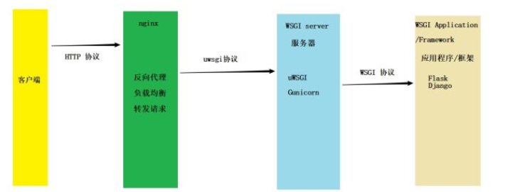

[WSGI](#WSGI)


Django通过startproject command 会生成一个default WSGI configuration，即主目录下有一个WSGI.py文件

<!--more-->

#### application 对象

Server通过application callable 与 代码做交互， application callable 以一个位于 Python 模块中，名为 `application` 的对象的形式提供，且对服务器可见。

通过**runserver**命令起的是**django默认服务器。** 用的是python http server.


[参考](https://docs.djangoproject.com/zh-hans/3.0/howto/deployment/wsgi/)



client  <---->  nginx  <----> socket  <----> uwsgi  <-----> django

#### django起服务

在生产环境 不要用 python manage.py runserver 起服务 [参考](https://serverfault.com/questions/717568/risks-of-using-django-manage-py-runserver-for-production-in-a-small-scale-server)

> DO NOT USE THIS SERVER IN A PRODUCTION SETTING. It has not gone through security audits or performance tests. (And that’s how it’s gonna stay.


#### WSGI <a name="WSGI"> </a>
* 让web服务器知道如何调用Python应用程序，并把用户请求告诉应用程序
* 让Python应用程序(application)知道用户的具体请求是什么,以及如何返回结果给Web服务器

#### Server如何调用application
* 每个application的入口只有一个，就是**所有客户端请求都同一个入口**进入到应用程序
* server需要知道从哪里找application的入口
  * application的可调用对象(函数或类)
  * WSGI定义了application对象的形式
  ```py
  def simple_app(environ,start_response):
    pass
  ```
  * django中就是在wsgi.py中有 application = get_wsgi_application()
  * environ
    * dict,存放了所有和客户端相关的信息,就能知道客户端请求的资源是什么，请求中带了什么数据
      * REQUEST_METHOD,QUERY_STRING:HTTP请求中的查询字符串，URL中?后面的内容,CONTENT_TYPEHTTP headers中的content-type内容 等等
  * start_response
    * 可调用的对象
    * 接收两个必选一个可选参数
      * status
      * response_headers
      * exc_info
  * application的返回值用于为HTTP提供body

[WGSI简易教程](https://www.xncoding.com/2016/04/22/python/wsgi.html)

#### WSGI 中间件
* middleware 运行在server和application中间
  * 对server来说,middleware就是application
  * 对application来说,middleware就是server
* middleware能处理所有经过的request和response
##### Gunicorn 和 uWSGI的区别

都算WSGI web server，区别不太大， Gunicorn用的更广一点，ins有用


* production mode
  * Gunicorn 托管 django
  * uWSGI 托管 django
  * Apache 和 mod_wsgi 托管 django

###### Gunicorn

```
pip install gunicorn
```

在项目主目录下生成gunicorn配置文件 

```python
import multiprocessing

bind = "127.0.0.1:8000"  # 绑定的ip与端口
workers = 2  # 核心数
errorlog = "/home/xyu3/codes/fasys/logs/gunicorn.error.log"  # 发生错误时log的路径
accesslog = "/home/xyu3/codes/fasys/logs/gunicorn.access.log"  # 正常时的log路径
# loglevel = 'debug'   #日志等级
proc_name = "gunicorn_fasys"  # 进程名
```

然后在主目录用nohup挂载后台运行

```bash
nohup gunicorn 项目名.wsgi:application -c /home/xxx/xxx/gunicorn.conf.py & 
```

或者直接

```
nohup gunicorn 项目名.wsgi:application -b 127.0.0.1:8000 &
```

接着把gunicorn放到supervisor进程管理器中

```
[program:x508server]
command=gunicorn x508server.wsgi:application -b 0.0.0.0:8000  ; 被监控的进程路径
directory=/home/webserver/web/WebServer/               ; 执行前要不要先cd到目录$
autostart=true                ; 随着supervisord的启动而启动
autorestart=true              ; 自动重启。。当然要选上了
startretries=10               ; 启动失败时的最多重试次数
exitcodes=0                   ; 正常退出代码
stopsignal=KILL               ; 用来杀死进程的信号
stopwaitsecs=10               ; 发送SIGKILL前的等待时间
redirect_stderr=true          ; 重定向stderr到stdout
stdout_logfile=/home/webserver/web/logfile.log        ; 指定日志文件
; 默认为 false，如果设置为 true，当进程收到 stop 信号时，会自动将该信号发给该进$
stopasgroup=true             ; send stop signal to the UNIX process
; 默认为 false，如果设置为 true，当进程收到 kill 信号时，会自动将该信号发给该进$
killasgroup=true             ; SIGKILL the UNIX process group (def false)
```

```bash
[program:fasys_gunicorn]
  
command     = /home/xyu3/anaconda3/envs/py36/bin/gunicorn fasys.wsgi:application -c /home/xyu3/codes/fasys/gunicorn.conf.py
directory   = /home/xyu3/codes/fasys/
user        = xyu3
startsecs   = 3
autostart   = true
autorestart = true
startretries = 3
exitcodes   = 0
stopsignal = KILL

redirect_stderr         = true ; 重定向stderr到stdout
stdout_logfile_maxbytes = 50MB
stdout_logfile_backups  = 10
stdout_logfile          = /home/xyu3/codes/fasys/logs/supervisor_gunicorn.log
```

```
supervisorctl
update #更新配置
reload # 重新启动配置的程序
status # 查看状态
```

###### 配置nginx

```bash
server {
    listen 80;
    server_name 10.127.3.101;
    access_log /home/xyu3/codes/fasys/logs/nginx.access.log;
    error_log /home/xyu3/codes/fasys/logs/nginx.error.log;

    #index login.html;
    #root /home/xyu3/codes/fasys/;

    location / {
        try_files $uri $uri/ =404;
    }

    location /apis {
        rewrite ^.+apis/?(.*)$ /$1 break;
        proxy_pass http://127.0.0.1:8000;
        proxy_pass_header       Authorization;
        proxy_pass_header       WWW-Authenticate;
        proxy_set_header Host $host;
        proxy_set_header X-Real-IP $remote_addr;
        proxy_set_header X-Forwarded-For $proxy_add_x_forwarded_for;
    }

    location /admin {
        proxy_pass http://127.0.0.1:8000;
        proxy_pass_header       Authorization;
        proxy_pass_header       WWW-Authenticate;
        proxy_set_header Host $host;
        proxy_set_header X-Real-IP $remote_addr;
        proxy_set_header X-Forwarded-For $proxy_add_x_forwarded_for;
    }
```

```
sudo nginx -t 测试配置有无问题
sudo service nginx restart 重启nginx
```


###### uWSGI

因为uswgi本身是个C应用，所以需要一个C编译器 gcc和python-dev

虚拟环境中uwsgi的安装有坑，主要和gcc版本有关，需要低版本gcc. [参考](https://github.com/unbit/uwsgi/issues/1770)

```
sudo apt-get  install gcc-4.8
sudo rm /usr/bin/gcc
sudo ln -s /usr/bin/gcc-4.8 /usr/bin/gcc

pip install uwsgi==2.0.15
sudo rm /usr/bin/gcc
sudo ln -s /usr/bin/gcc-7 /usr/bin/gcc
```

部署

运行uWSGI启动一个会把请求传递给WSGI应用的 HTTP 服务器

```
uwsgi --http 127.0.0.1:8000 --wsgi-file
```

配置文件

```
socket：uwsgi监听的socket，可以为socket文件或ip地址+端口号(如0.0.0.0:9000)，取决于nginx中upstream的设置

chdir：在app加载前切换到当前目录

pythonpath：给PYTHONPATH 增加一个目录（或者一个egg），最多可以使用该选项64次。

module：加载指定的python WSGI模块（模块路径必须在PYTHONPATH里）
```


uWSGI 搭配 nginx 配置

[upstream配置](https://www.jianshu.com/p/8671c40a5be8)

```bash
upstream django {
    # server unix:///path/to/your/mysite/mysite.sock; # for a file socket
    server 127.0.0.1:8001; # for a web port socket (we'll use this first)
    server 192.168.1.235:3031;
    server 10.0.0.17:3017;
}
server {
    listen 8002;
    server_name 10.127.3.101;
    location / {
        uwsgi_pass  django;
        include    /home/xyu3/codes/fasys/uwsgi_params.conf; 
        # 上述文件可以在这里下载 https://github.com/nginx/nginx/blob/master/conf/uwsgi_params
    }
}
```

client 不直接与uWSGI交互，而是通过web server (Nginx)。

```bash
# conf.ini
[uwsgi]

socket = 127.0.0.1:8001
# Django-ralated settings
# the base directory (full path)
chdir = /home/xyu3/codes/fasys
# Django's wsgi file
module = fasys.wsgi
# the virtualenv (full path)
home = /home/xyu3/anaconda3/envs/py36

# with appropriate permissions 
chmod-socket = 664

# process-related settings
master = true
# maximum number of worker processes
processes = 4
# the socket (use the full path to be safe
; socket          = /home/xyu3/codes/fasys/mysite.sock
# clear environment on exit
vacuum          = true

; wsgi-file = /home/xyu3/codes/fasys/fasys/wsgi.py
# 设置一个地址，可以通过该地址监控运行状态，输出 JSON 格式的数据
stats = 127.0.0.1:8080# conf.ini
[uwsgi]

socket = 127.0.0.1:8001
# Django-ralated settings
# the base directory (full path)
chdir = /home/xyu3/codes/fasys
# Django's wsgi file
module = fasys.wsgi
# the virtualenv (full path)
home = /home/xyu3/anaconda3/envs/py36

# with appropriate permissions 
chmod-socket = 664

# process-related settings
master = true
# maximum number of worker processes
processes = 4
# the socket (use the full path to be safe
; socket          = /home/xyu3/codes/fasys/mysite.sock
# clear environment on exit
vacuum          = true

; wsgi-file = /home/xyu3/codes/fasys/fasys/wsgi.py
# 设置一个地址，可以通过该地址监控运行状态，输出 JSON 格式的数据
stats = 127.0.0.1:8080
```


 