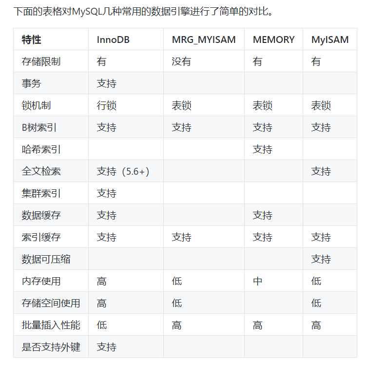

### mysql 的引擎
mysql的存储方式由引擎决定，常用的有Innodb和MySiam。
* 不同的引擎区别在于如何存储和索引数据，是否使用事务
<!--more-->
#### MySiam
* MySiAM不支持事务，不支持外键，强调的是性能，执行速度比Innodb要快
  * 适用于**对事务完整性没有要求，或者以select，insert为主的应用，可以用这个引擎建表**

#### Innodb
* Innodb提供支持事务等高级数据库功能。
* 适用于并发条件下要求数据的一致性，数据操作有较多的update和delete
  * MySQL支持外键的engine只有Innodb,创建外键的时候,父表必须有对应的索引，子表在创建外键的时候，也会自动创建对应的索引
    * 在设定外键时支持多个模式，即在删除或更新父表的时候，对子表进行相应操作
      * restrict. no action 限制在子表有关联记录的情况下，父表不能更新
      * cascade 父表在更新或删除时，更新或删除子表对应的记录
      * set null 父表在更新或删除时，子表对应字段被set null
  * 存储方式-- 存储表和索引有两种方式
    * 共享表空间存储
      * 表结构保存在.frm 文件中
      * 数据和索引保存在innodb_data_home_dir和innodb_data_file_path 定义的表空间中，可以是多个文件
    * 多表空间存储
      * 表结构保存在.frm 文件中
      * 每个表的数据和索引单独保存在.ibd中
      * 如果是个分区表，则每个分区对应单独的.ibd文件，文件名是“表名+分区名”，可以在创建分区的时候指定每个分区的数据文件的位置，以此来将表的IO 均匀分布在多个磁盘

### 选择合适的数据类型

首先选择合适的存储引擎，根据指定的存储引擎确定合适的数据类型。

#### char 和 varchar
* MyISAM: 最好使用固定长度的数据列代替可变长度的数据列。
* InnoDB: 建议使用varchar
  * 没有区分固定长度和可变长度列（所有数据行都使用指向数据列值的头指针）用固定长度的CHAR 列不一定比使用可变长度VARCHAR 列性能要好。因而，主要的性能因素是数据行使用的存储总量。由于CHAR 平均占用的空间多于VARCHAR，因此使用VARCHAR 来最小化需要处理的数据行的存储总量和磁盘I/O 是比较好的

#### 浮点数float和定点数decimal

* 浮点数
  * 字段定义成float,插入数据精度超过该列定义的实际精度，插入值会被四舍五入到实际定义的精度值
* 定点数
  * 实际以字符串形式存放，可以更加精确保存数据。 如果插入数据精度超过该列定义的实际精度,取决于SQLMode,若是traditional就会直接报错，导致数据无法插入

单精度浮点数表示会有误差
* 如插入131072.32，数据库中存131072.31
* 浮点数的比较 7.22-7.0=0.21999979

精度要求比较高的应用中（比如货币）要使**用定点数而不是浮点数**来保存数据  
编程中应尽量避免浮点数的比较，如果非要使用浮点数比较则最好使用范围比较而不要使用“==

### 字符集
创建数据库使用utf8，CREATE DATABASE IF NOT EXISTS my_db default charset utf8 COLLATE utf8_general_ci


### mysql 与mongodb 区别

mysql 关系型，mongodb非关系型

关系型 mysql, sql server, postgre sql

* 关系型数据库相对安全，因为存在硬盘

非关系型 mongodb, redis, Memcached HBase

* Mongo的存储方式为虚拟内存+持久化存储，Mongo将数据写入内存中，再由虚拟内存管理器将其持久化到硬盘中，因此写操作会比关系型数据库快很多。不支持事务，也不能进行联表查询，一般用于较大规模数据的存储。
* 什么时候适合
  * 日志系统 -- 系统运行产生的日志 一般种类多，范围大 内容杂乱
  * 地理位置存储
  * 数据规模增长很快 - mongo 分库分操作简单
  * 保证高可用
  * 文件存储需求





##### 建立索引

1. 可以建立前缀索引 来减少索引的占用空间

   ```sql
   create index idx_student_name_1 on tb_student(stuname(1));
   ```

2. 最适合索引的列 -**- where中的 以及 连接字句中的列**

3. 索引并非越多越好，加速了查操作，但是写操作变得很慢

4. InnoDB存储引擎，表的普通索引都会保存主键的值，主键要尽可能较短的数据类型，有效减少索引占用空间

5. InnoDB用的B+索引，数值类型的列在等值判断, >,<, >=,<=,between.. and <>时，索引生效
   1. 字符串类型的列，如果不是通配符开头的模糊查询，索引也是起作用的
   2. 索引失效，意味着做全表查询


### 视图

视图是关系型数据库中将一组查询指令构成的结果集组合成可查询的数据表的对象。简单的说，视图就是虚拟的表，但与数据表不同的是，数据表是一种实体结构，而视图是一种虚拟结构，你也可以将视图理解为保存在数据库中被赋予名字的SQL语句。


#### MySQL Blob类型

* BLOB是一个大型二进制对象, 可存储大量数据的容器

* 插入BLOB类型的数据必须使用preparedStatement, 因为BLOB类型的数据无法使用字符串拼接

* 如果存储的文件过大, 数据库的性能会下降

  * TinyBlob - 最大 255 byte
  * Blob -- 最大 65 K
  * MediumBlob 最大 16 M
  * LongBlob 最大 4G
