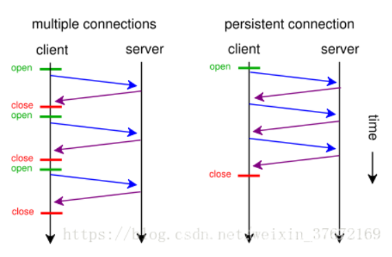
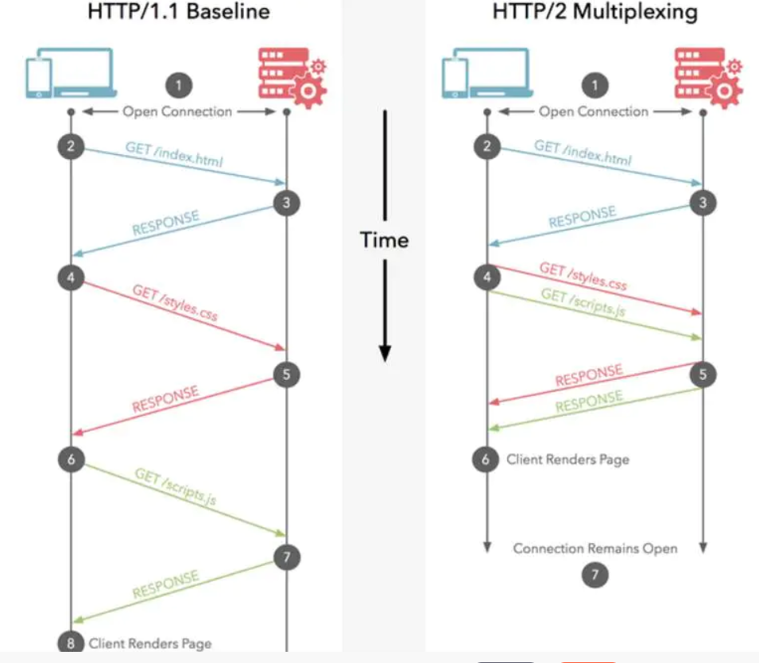

[http有哪些头部](#http有哪些头部)
[https的加密过程详细讲一下](#https的加密过程详细讲一下)
[put和post什么区别](#put和post什么区别)
[get和post有什么区别](#get和post有什么区别)
[http幂等性是什么](#http幂等性是什么)
[有哪些加密](#加密)
[输入url整个过程](#输入url的全过程)

<!--more-->
#### http有哪些头部
* General Header Fields
  * Cache-control
    * max-age 客户端最多保存缓存多少秒
    * no-cache 可以缓存，但使用前必须去服务器验证是否过期
    * no-store 响应不缓存，适合变化频繁的页面如秒杀页面
  * Connection
    * keep-alive http/1.1 默认启用长连接
    * close 过多长连接会占用服务器资源，客户端主动通知服务器关闭连接
  * Transfer-encoding
* Request Header Fields
  * Accept
    * 客户端希望接收的数据类型
    * text / iamge/ audio/video/aplication:json,key value
  * Refer
    * 代表这个request从哪里来，可用于判断是否是合法的domain
  * Range
    * 断点传输
  * Host
    * 指定资源所在服务器
  * User-Agent
    * 客户端程序信息
* Response Header Fields
  * http-version
  * status-code
  * accept-range
  * location
    * 响应码
      * 301 永久重定向
      * 302 临时重定向
* Entity Header Fields
  * content-type
  * content-length
  * last-modified
* Cookie
  * key-value格式
  * 量一大就占带宽

#### 加密
* 对称性加密
  * 加密解密用同一个密钥，**难点在于密钥的传送**
* 密钥交换
  * Diffie-Hellman
* 非对称性加密
  * 公钥加密，私钥解密
  * RSA就是典型的非对称加密，**速度比较慢**,耗时
    * 传大量数据时，一般不用公钥直接加密数据，而是加密对称性加密的密钥
  * 无法确定通信双方的身份，依然有中间人攻击
* 数字签名
  * 公布公钥，用私钥加密数据，把加密的数据公布出去
  * 对于RSA算法，私钥加密的数据只有公钥可以解开
  * 目的是为了证明身份，证明这些数据是由本人发出的
* 公钥证书
  * 证书就是**公钥和签名**，由第三方机构颁发
  * 证书认证的流程
    * Bob 去可信任的认证机构证实本⼈真实⾝份，并提供⾃⼰的公钥。
    * Alice 想跟 Bob 通信，⾸先向认证机构请求 Bob 的公钥，认证机构会把⼀张证书（Bob 的公钥以及⾃⼰对其公钥的签名）发送给 Alice。
    * Alice 检查签名，确定该公钥确实由这家认证机构发送，中途未被篡改。(安装的正规浏览器中都预存了正规认证机构的证书（包含其公钥），⽤于确认机构⾝份，所以说证书的认证是可信的)
    * Alice 通过这个公钥加密数据，开始和 Bob 通信

#### https的加密过程，详细讲一下
在 HTTP 协议和 TCP 协议之间加了⼀个 **SSL/TLS** 安全层.
* SSL(secure socket layer)
* TLS(transport layer security)
* 目前已经用TLS替代了废弃的SSL协议, 只是仍然沿用SSL一词。
* 在通信双方建立可靠的 TCP 连接之后，需要通过**TLS 握手**交换双方的密钥了
* TLS 协议会在 TCP 协议之上通过四次握手建立 TLS 连接保证通信的安全性
在你的浏览器和⽹站服务器完成 TCP 握⼿后，SSL 协议层也会进⾏**SSL握⼿交换安全参数**，其中就包含该**⽹站的证书**, 以便浏览器验证站点⾝份。SSL 安全层验证完成之后，上层的 **HTTP 协议内容都会被加**密，保证数据的安全传输。
* 客户端请求服务器获取证书**公钥和签名**
* 客户端(SSL/TLS)解析证书，验证证书是否有效
  * 用公钥解密签名值和原始内容(签名也是由私钥针对明文加密得到的)对比来验证证书的合法性
* 客户端生成随机值,用 公钥加密 随机值生成密钥
* 客户端将 秘钥 发送给服务器
* 服务端用 私钥 解密 秘钥 得到随机值
* 将信息和随机值混合在一起 进行对称加密
* 将加密的内容发送给客户端

#### http幂等性是什么
* HTTP方法的幂等性是指**一次和多次请求某一个资源应该具有同样的副作用**, 强调的是一次和N次具有相同的副作用，而不是每次结果相同
* 强调的是一次和N次具有相同的副作用，而不是每次GET的结果相同。不会改变资源的状态，不论调用一次还是N次都没有副作用。GET `http://www.news.com/latest-news`这个HTTP请求可能会每次得到不同的结果，但它本身并没有产生任何副作用，因而是满足幂等性的。
* DELETE方法用于删除资源，有副作用，但它应该满足幂等性。比如：DELETE `http://www.forum.com/article/4231`，调用一次和N次对系统产生的副作用是相同的，即删掉id为4231的帖子；因此，调用者可以多次调用或刷新页面而不必担心引起错误

#### get和post有什么区别
* get和post有什么区别 [参考](https://blog.fundebug.com/2019/02/22/compare-http-method-get-and-post/)
  * GET 用于获取信息，是无副作用的，是幂等的，且可缓存
  * POST 用于修改服务器上的数据，有副作用，非幂等，不可缓存
  * GET把参数包含在URL中，POST通过request body
  * GET请求在URL中传送的参数是有长度限制的，而POST么有 (和http无关，与浏览器服务器有关)
  * GET产生一个TCP数据包；POST产生两个TCP数据包 **不对**
    * 对于GET方式的请求，浏览器会把http header和data一并发送出去，服务器响应200（返回数据
    * 对于POST，浏览器先发送header，服务器响应100 continue，浏览器再发送data，服务器响应200 ok（返回数据） 
      * 在网络环境好的情况下，发一次包的时间和发两次包的时间差别基本可以无视。而在网络环境差的情况下，两次包的TCP**在验证数据包完整性**上，有非常大的优点

#### put和post什么区别
* POST和PUT的区别容易被简单地误认为“POST表示创建资源，PUT表示更新资源”；而实际上，**二者均可用于创建资源**，更为本质的差别是**在幂等性**方面
  * POST所对应的URI并非创建的资源本身，而是**资源的接收者**。比如：POST `http://www.forum.com/articles的语义是在http://www.forum.com/articles`下创建一篇帖子，HTTP响应中应包含帖子的创建状态以及帖子的URI。两次相同的POST请求会在服务器端**创建两份资源**，它们具有不同的URI；所以，POST方法不具备幂等性
  * PUT所对应的URI是要创建或更新的资源本身。比如：PUT `http://www.forum/articles/4231`的语义是创建或更新ID为4231的帖子。对同一URI进行多次PUT的副作用和一次PUT是相同的；因此，PUT方法具有幂等性

#### 输入url的全过程
* DNS 解析:将域名解析成 IP 地址
* TCP 连接：TCP 三次握手
* 发送 HTTP 请求
* 服务器处理请求并返回 HTTP 报文
* 浏览器解析渲染页面
* 断开连接：TCP 四次挥手

#### http长连接和websocket区别
* 所谓http长连接就是http1.1的协议中规定了keep-alive字段,指定以后一次http请求后,底层的tcp连接不会断了,下一次可以复用。
* http的长连接本质上仍然是客户端发起请求,服务端应答的模式。**服务端不能主动给客户端**推数据。
* websocket可以实现server端主动推消息给client。
  * websocket也是属于应用层的协议,需要client和server通过TCP协议进行握手连接,单独建立一条TCP通信通道。
  * 流程如下
    * client和server建立TCP连接, 3次握手
    * TCP连接成功后,浏览器通过HTTP协议向服务器传送WebSocket支持的版本号等信息。（开始前的HTTP握手）
    * 服务器收到客户端的握手请求后，同样采用HTTP协议回馈数据
    * 当收到了连接成功的消息后，通过TCP通道进行传输通信
  * WebSocket在建立握手时，数据是通过HTTP传输的。但是建立之后，在真正传输时候是不需要TCP协议的

#### http1.1和http2的区别
* http1.1的keep-alive是指不需要多次建立连接,不是http2.0中的多路复用,其模式仍然是client发一个request,server对应返回一个response
* http2.0的多路复用就是client可以同时向server发多个request,服务器端同时响应多个response

