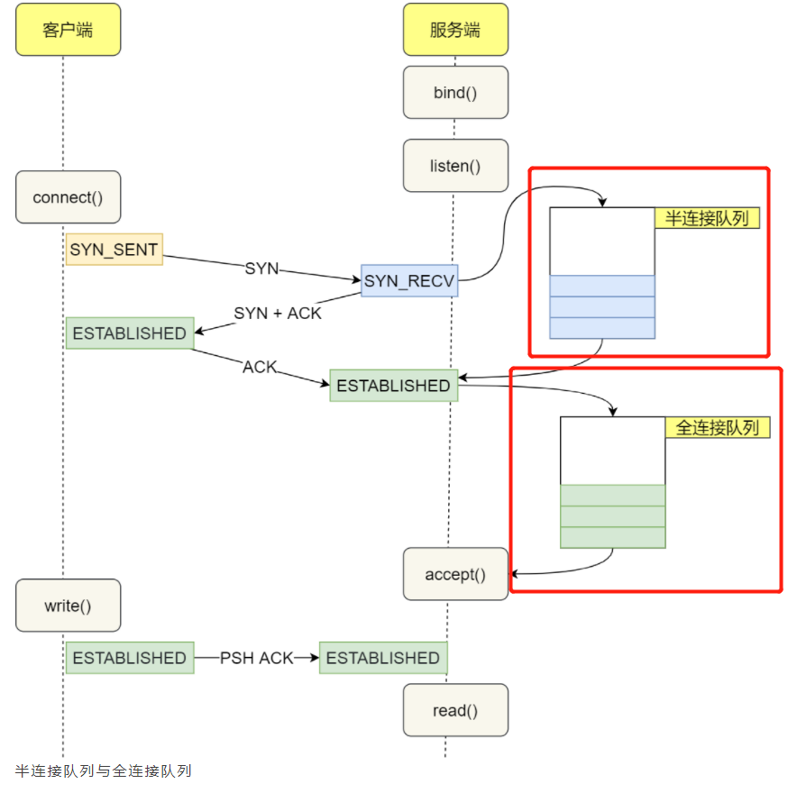

[TCP和UDP区别](#tcp和udp区别)  
[TCP的流量控制](#tcp的流量控制)  
[TCP拥塞控制](#tcp拥塞控制)  
[SYN洪水攻击](#syn洪水攻击)  
[为什么需要三次握手连接而不是两次或者其他次数](#为什么需要三次握手连接而不是两次或者其他次数)  
[TCP四次挥手time_wait和closed_wait](#tcp四次挥手time_wait和closed_wait)

<!--more-->

#### TCP和UDP区别

* TCP面向连接;UDP是无连接的，即发送数据之前不需要建立连接
* TCP提供可靠的服务,通过TCP连接传送的数据，无差错，不丢失，不重复，且按序到达;UDP尽最大努力交付，即不保证可靠交付
* TCP面向字节流，实际上是TCP把数据看成一连串无结构的字节流;UDP是面向报文的UDP没有拥塞控制，因此网络出现拥塞不会使源主机的发送速率降低（对实时应用很有用，如IP电话，实时视频会议等

#### TCP的流量控制  
如果sender发送数据过快，receiver来不及接收，就会有分组丢失。**为了避免分组丢**失，控制发送者的发送速度，使得接收者来得及接收。目的是防止分组丢失，保证TCP可靠性。

实现
* 滑动窗口协议，既保证了分组无差错、有序接收，也实现了流量控制。
* 主要的方式就是接收方返回的 ACK 中会包含自己的接收窗口的大小，并且利用大小来控制发送方的数据发送。

引发的死锁，如何避免？
* sender收到了一个窗口为0的应答，发送者**便停止发送**，**等待接收者的下一个应答**。但是**如果这个窗口不为0的应答在传输过程丢失，发送者一直等待下去**，而接收者以为发送者已经收到该应答，等待接收新数据，这样双方就相互等待，从而产生死锁。
* 为了避免流量控制引发的死锁，TCP使用了**持续计时器**。每当发送者收到一个零窗口的应答后就启动该计时器。时间一到**便主动发送报文询问接收者的窗口大小**。若接收者仍然返回零窗口，则重置该计时器继续等待；若窗口不为0，则表示应答报文丢失了，此时重置发送窗口后开始发送，这样就避免了死锁的产生。

[TCP流量控制、拥塞控制](https://zhuanlan.zhihu.com/p/37379780)

#### TCP拥塞控制
与流量控制区别
* 拥塞控制：拥塞控制是作用于网络的，它是防止过多的数据注入到网络中，**避免出现网络负载过大**的情况；
  * 常用的方法
  * 慢开始、拥塞避免
  * 快重传、快恢复。

流量控制：流量控制是**作用于接收者**的，它是**控制发送者的发送速度**从而使接收者来得及接收，防止分组丢失的

* 慢开始
  * 发送方维持一个叫做拥塞窗口cwnd（congestion window）的状态变量。拥塞窗口的大小取决于网络的拥塞程度，并且动态地在变化。发送方让自己的发送窗口等于拥塞窗口，另外**考虑到接受方的接收能力，发送窗口可能小于拥塞窗口**。
  * 慢开始算法的思路就是，**不要一开始就发送大量的数据**，先探测一下网络的拥塞程度，也就是说**由小到大逐渐增加拥塞窗口的大小**。
  * 一个传输轮次所经历的时间其实就是往返时间RTT，而且每经过一个传输轮次（transmission round），拥塞窗口cwnd就加倍
    * 当cwnd<ssthresh时，使用慢开始算法。
    * 当cwnd>ssthresh时，改用拥塞避免算法。
    * 当cwnd=ssthresh时，慢开始与拥塞避免算法任意
* 拥塞避免
  * 当cwnd>ssthresh时，让拥塞窗口缓慢增长，即每经过一个往返时间RTT就把发送方的拥塞窗口cwnd加1
* 无论是在慢开始阶段还是在拥塞避免阶段，只要发送方判断网络出现拥塞（其根据就是**没有按时收到确认**，虽然没有收到确认可能是其他原因的分组丢失，但是因为无法判定，所以都当**做拥塞**来处理），
  * 就把慢开始门限**ssthresh设置为出现拥塞时的发送窗口大小的一半（但不能小于2**）。然
  * 后把**拥塞窗口cwnd重新设置为1**，执行慢开始算法。
* 快恢复
  * 当发送方连续收到三个重复确认时，就执行“乘法减小”算法，**把ssthresh门限减半**（为了预防网络发生拥塞）。但是接下去并**不执行慢开始**算法
  * 如果网络出现拥塞的话就**不会收到好几个重复的确认**，所以发送方现在认为网络可能没有出现拥塞。所以此时不执行慢开始算法
  * 将cwnd设置为ssthresh减半后的值，然后执行**拥塞避免**算法，使cwnd缓慢增大
  * 在采用快恢复算法时，慢开始算法只是在TCP连接建立时和网络出现超时

#### TCP 重传机制

* 超时重传

TCP 实现可靠传输的方式之一是通过序列号和确认应答。

发送数据时，设定一个定时器，超过指定的时间没接收到对方的ACK, 就会重发该数据。

以下两种情况会发生超时重传：

1. 数据包丢失
2. ACK丢失

* 快重传

以数据驱动重传, 三份同样的ACK就会触发快速重传。

在上图，发送方发出了 1，2，3，4，5 份数据：

- 第一份 Seq1 先送到了，于是就 Ack 回 2；
- **结果 Seq2 因为某些原因没收到**，Seq3 到达了，于是还是 Ack 回 2；
- 后面的 Seq4 和 Seq5 都到了，但还是 Ack 回 2，因为 Seq2 还是没有收到；
- **发送端收到了三个 Ack = 2 的确认，知道了 Seq2 还没有收到，就会在定时器过期之前，重传丢失的 Seq2。**
- 最后，收到了 Seq2，此时因为 Seq3，Seq4，Seq5 都收到了，于是 Ack 回 6 。

快速重传的工作方式是当收到三个相同的 ACK 报文时，会在定时器过期之前，重传丢失的报文段。

**重传的时候，是重传之前的一个，还是重传所有的问题。**

比如对于上面的例子，是重传 Seq2 呢？还是重传 Seq2、Seq3、Seq4、Seq5 呢？因为发送端并不清楚这连续的三个 Ack 2 是谁传回来的。

#### 为什么需要三次握手连接而不是两次或者其他次数
* 三次握手才能阻止重复历史连接的初始化
  * sender向receiver发出请求 SEQ = 100,CTL= SYN
    * 此时由于网络较差之类的问题,sender可能连续发送多次建立连接的请求，如果TCP建立连接只能通信两次，receiver并不清楚这次的请求是不是因为网络拥堵而已经过期的连接
    * receiver收到请求时，发回 ACK = SEQ + 1 , SYN 让sender判断这次的连接是否过期
      * 如果是历史连接，sender就会发送RST控制消息终止这次连接
      * 如果不是历史连接，sender就会发送ACK，通信双方就会成功建立连接
  * 不是四次的原因
    * TCP消息头的设计，可以把中间两次通信合成一个，即receiver可以同时向sender发送ACK和SYN
* 三次握手才能对通信双方的初始序列号进行初始化
  * 网络的不确定性导致数据包的丢失或者顺序颠倒
    * 数据包被sender重复发送导致数据重复
    * 数据包在传输中被路由或者其他节点丢失
    * 数据包到达receiver时没有按照发送顺序
  * 通过序列号
    * receiver借助序列号**对数据包去重，重新排序**
    * sender在对应数据包**未被ACK时重复发送**

[为什么 TCP 建立连接需要三次握手](https://draveness.me/whys-the-design-tcp-three-way-handshake/)

#### SYN洪水攻击
一个客户端不理会服务端发来的ack，一直重发syn怎么办

当服务端收到 SYN 包后，服务端会立马回复 SYN+ACK 包，表明确认收到了客户端的序列号，同时也把自己的序列号发给对方。

服务端出现了新连接，状态是 `SYN_RCV`，Linux内核会建立一个**半连接队列**来维护 未完成的握手信息。 半连接队列溢出后，server就无法再**建立新的连接**。**SYN 攻击，攻击的是就是这个半连接队列**。

* 如果 SYN 半连接队列已满，只能丢弃连接吗？
  * 开启 syncookies 功能就可以在不使用 SYN 半连接队列的情况下成功建立连接。

Syn flooding 解决方式  [参考](https://www.zhihu.com/question/26741164/answer/52776074)

syncookies 的工作原理：服务器根据当前状态计算出一个值，放在己方发出的 SYN+ACK 报文中发出，当客户端返回 ACK 报文时，取出该值验证，如果合法，就认为连接建立成功

#### TCP四次挥手time_wait和closed_wait

客户端和服务端双方都可以主动断开连接，**通常先关闭连接的一方称为主动方，后关闭连接的一方称为被动方。**

* 被动方在收到FIN报文后，内核自动回复ACK，连接从ESTABLISHED进入CLOSE_WAIT,表示被动方在**等待进程调用close函数关闭连接**。
* 当被动方进入 CLOSE_WAIT 时，被动方还会继续处理数据，等到进程的 read 函数返回 0 后，应用程序就会调用 close 函数，进而触发内核发送 FIN 报文，此时被动方的连接状态变为 LAST_ACK
* 当主动方收到这个 FIN 报文后，内核会回复 ACK 报文给被动方，同时主动方的连接状态由 FIN_WAIT2 变为 **TIME_WAIT**，**在 Linux 系统下大约等待 1 分钟后，TIME_WAIT 状态的连接才会彻底关闭**
* 当被动方收到最后的 ACK 报文后，**被动方的连接就会关闭**
* **主动关闭连接的，才有 TIME_WAIT 状态**

[面试官：换人！他连 TCP 这几个参数都不懂](https://www.cnblogs.com/xiaolincoding/p/13067971.html)