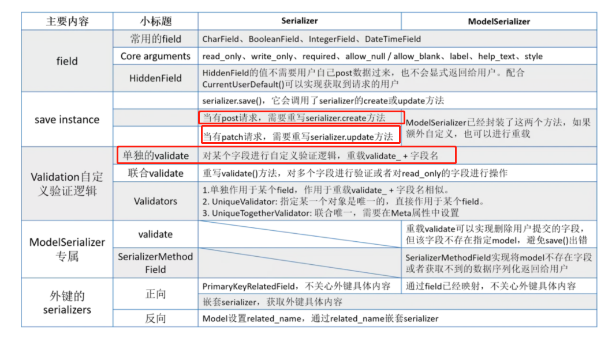

DRF的serializer可以实现

* 控制序列化后相应数据的格式
* 在反序列化时对客户端传来的数据进行验证(validation)
* 重写序列化器类自带的create 和 update

<!--more-->

#### Serializer增加 update() / create () 写法

```python
class CommentSerializer(serializers.Serializer):
    email = serializers.EmailField()
    content = serializers.CharField(max_length=200)
    created = serializers.DateTimeField()

    def create(self, validated_data):
        return Comment(**validated_data)

    def update(self, instance, validated_data):
        instance.email = validated_data.get('email', instance.email)
        instance.content = validated_data.get('content', instance.content)
        instance.created = validated_data.get('created', instance.created)
        return instance
```

when deserializing data, we can call `.save()` to return an object instance, based on the validated data.

```python
comment = serializer.save()

# Calling .save() will either create a new instance, or update an existing instance, depending on if an existing instance was passed when instantiating the serializer class:

# .save() will create a new instance.
serializer = CommentSerializer(data=data)

# .save() will update the existing `comment` instance.
serializer = CommentSerializer(comment, data=data)
```





自定义序列化类的序列化、反序列化或验证过程的行为，可以通过重写`.to_representation()`或`.to_internal_value()`方法来完成。

#### to_internal_value(self,data)

将未经验证的传入数据作为输入，返回可以**通过`serializer.validated_data`来访问的已验证的数据**。如果在序列化类上调用`.save()`，则该返回值也将传递给`.create()`或`.update()`方法。这是反向的过程，由前端数据往后端保存。

如果任何验证条件失败，那么该方法会引发一个`serializers.ValidationError(errors)`。通常，此处的`errors`参数将是错误消息字典的一个映射字段，或者是`settings.NON_FIELD_ERRORS_KEY`设置的值。

传递给此方法的**`data`参数通常是`request.data`的值，**因此它提供的数据类型将取决于你为API配置的解析器类。

#### to_representation(self,obj)

接收一个需要被序列化的对象实例并且返回一个序列化之后的表示。通常，这意味着**返回内置Python数据类型的结构**。可以处理的确切类型取决于你为API配置的渲染类。这是**正向过程，由后端往前端**。

[Django REST framework 序列化器](https://www.liujiangblog.com/blog/43/)


##### validate

```python
def validate(self,data):
	'''
	做一些校验
	'''
	return 
    
serializer.object.get('token')
```

