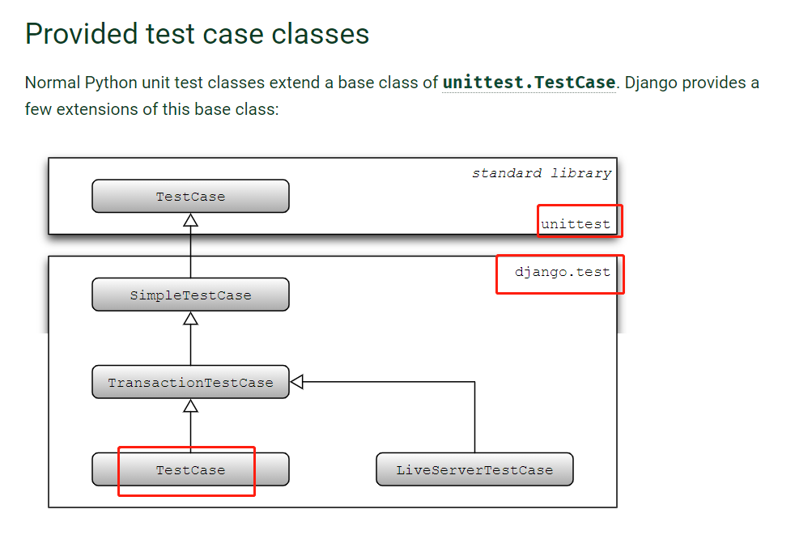

### Django unit test
<!--more-->




* SimpleTestCase


涉及到数据库的操作

* TransactionTestCase
* TestCase


class-wide initialization 

```python
class MyTestCase(TestCase):

    @classmethod
    def setUpClass(cls):
        super().setUpClass()
        ...

    @classmethod
    def tearDownClass(cls):
        ...
        super().tearDownClass()
```


#### setUp(self) 和 setUpClass(cls) 区别

* setUpClass(cls) 是类方法
  * 初始化的数据是整个class share
* setUp(self) 是实例方法
  * 每次run一个新的test method 会重新初始化一下，
* setUpTestData(cls)
  * 是通过setUpClass() 和 tearDownclass()共同实现的
  * 生成的data 持续整个testcase


通过setUpClass(cls) 初始化的结果属于整个类share，那么就可能存在被一个test method修改了以后 那么setUpClass中的数据就变了，因此引入了 refresh_from_db

[参考](https://makina-corpus.com/blog/metier/2015/how-to-optimize-django-unit-tests-with-setuptestdata)

```python
class PersonTest(TestCase):
    @classmethod
    def setUpTestData(cls):
        cls.alice = Person.objects.create(first_name='Alice', last_name='Smith')
        cls.bob = Person.objects.create(first_name='Bob', last_name='Smith')

    def setUp(self):
        self.alice.refresh_from_db()
        self.bob.refresh_from_db()

    def test_alice_first_name(self):
        self.assertEqual(self.alice.first_name, 'Alice')

    def test_bob_first_name(self):
        self.assertEqual(self.bob.first_name, 'Bob')

    def test_bob_first_name_modified(self):
        self.bob.first_name = 'Jack'
        self.bob.save()
        self.assertEqual(self.bob.first_name, 'Jack')
```


#### 运行方式

```bash
python manage.py test
```


### Pytest

#### 类Xunit

[reference](https://docs.pytest.org/en/stable/xunit_setup.html)

```python
# Method and function level setup/teardown
def setup_method(self, method):
    """ setup any state tied to the execution of the given method in a
    class.  setup_method is invoked for every test method of a class.
    """


def teardown_method(self, method):
    """ teardown any state that was previously setup with a setup_method
    call.
    """

## Class level setup/teardown
@classmethod
def setup_class(cls):
    """ setup any state specific to the execution of the given class (which
    usually contains tests).
    """


@classmethod
def teardown_class(cls):
    """ teardown any state that was previously setup with a call to
    setup_class.
    """
```

弊端: class level 的setup/teardown中不能做一些db 相关的操作，pytest-django 实现的django_db 也不work， 而db是function级别的fixture，底层也是用到了TestCase的pre_set_up 和 post_tear_down.


django自带的test的好处在于class 级别 的setup和teardown 资源可以重复利用，不用function级别的操作


q1： 在测试某个接口的时候，可否用到其他的接口，比如场景，先创建用户，然后创建数据集，然后上传图片，然后针对图片做一些操作，


q2: 涉及到一些异步操作的接口， 怎么测试 比如 