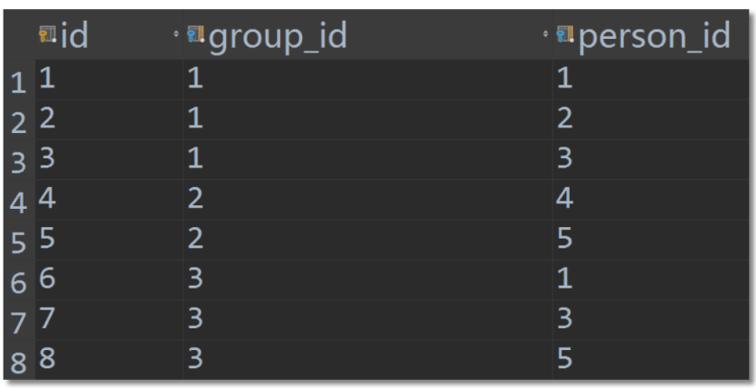

django多对多的关系可以通过ManyToManyField.
```py

from django.db import models

class Person(models.Model):
    name = models.CharField(max_length=128)
    def __str__(self): 
        return self.name

class Group_RAW(models.Model):
    name = models.CharField(max_length=128)
    members = models.ManyToManyField(Person)

    def __str__(self):
        return self.name

class Group(models.Model):
    name = models.CharField(max_length=128)
    members = models.ManyToManyField(Person, through='Membership')
    def __str__(self): 
        return self.name

class Membership(models.Model):
    person = models.ForeignKey(Person, on_delete=models.CASCADE)
    group = models.ForeignKey(Group, on_delete=models.CASCADE)
    date_joined = models.DateField()        # 进组时间
    invite_reason = models.CharField(max_length=64)  # 邀请原因

```

* Group_RAW的实现方式就是生成了一个中间关系表。一列是person表的主键，一列是group表的主键。

  

* 倘若还需要增加一些额外信息，例如该person进入该group的时间，就像Group实现的方式，在中间表中添加这些信息

  

#### 多对多关系（标签×文章）的关联表如果查找太慢怎么办
* 只在article上建索引。或许可以把每个标签前几页的文章缓存起来
* 标签的数量有限，重复度太高不适合建索引？