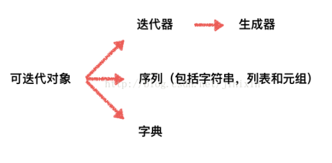

[TOC]


##### 装饰器 上下文管理器 什么场景

[装饰器参考](https://stackoverflow.com/questions/739654/how-to-make-a-chain-of-function-decorators/1594484#1594484)

例如统计函数运行时间，打印日志

函数装饰器 和 类装饰器


##### 上下文管理器 

基本语法

```python
with EXPR as VAR:
	BLOCK
with open("file.txt","r") as f: #上下文表达式
    lines = f.readlines()
# 上下文管理器: open("file.txt","r") 
```

上下文管理协议

* 一个类中实现了 `__enter__` ,  `__exit__`

场景

* 更优雅的方式操作(创建/获取/释放)资源 如文件操作，数据库连接
* 处理异常更优雅


##### list和set查询,谁复杂度低 why

* list 的底层实现
  * 长度可变的数组，对其他对象的引用组成的连续数组 
  * index() 查找元素 O(N),  pop(i) O(N)
* 集合的底层实现
  * 集合有两种
    * set() 可变，无序，有限
    * frozenset() 不可变 可哈希 无序
  * 带**有空值的字典**，只**有键才是集合**的元素
* if  i in list 和  if  i in set 哪个快
  * set快 set是算哈希 O(1) 平均， 而list是 O(n)

##### dict实现原理

* dict 实现原理

  * 伪随机探测(pseudo-random probing)的散列表(hash table)作为字典的底层数据结构

  * 可哈希的对象作为字典的键

    * python内置的所有不可变的内置类型都是可哈希的，可变类型不可哈希

    


##### 基础数据类型 可变，不可变

* 可变: list, set, dict
  * 可变对象变化后，地址没变 (可以用 id() 来查看地址)
* 不可变: int , float,string,bool, tuple

##### 深拷贝，浅拷贝

* a=b 不算拷贝，a=b只是把a的指针指向b的地址，

  ```bash
  >>>a = (1, 2, 3)
  >>>id(a)
  2139167074776
  >>> b = a
  >>> a = (4, 5, 6) 这个赋值会让 a指向另一个地址，而b只是指向原来那个地址
  >>> a
  (4, 5, 6)
  >>> b
  (1, 2, 3)
  >>> id(a)
  2139167075928
  >>> id(b)
  2139167074776
  ```

```
a = '123'
b = a
# 浅拷贝
c = copy.copy(a)
# 深拷贝
d = copy.deepcopy(a)
```

* 浅拷贝 按被拷贝的对象区分

  * 不可变 (int tuple，string)

    * 情况等价于 "=" 对象的id值与浅拷贝原来的值相同
  * 针对不可变对象，浅拷贝也是创建一个引用
  
* 可变对象 list,dict set
  
    * 当对象内无复杂子对象
      * 原来对象的id值 和 浅拷贝后的 不同
    * 浅拷贝后的对象值变化，不影响原来的值 反之
    
    * 有复杂子对象 如list嵌套list
      * 改变原来对象中的 复杂子对象的值，会影响 浅拷贝后的值
        * 浅复制 ，复杂子对象的保存方式是 作为 引用 方式存储的
    * 要想不影响 就用 深拷贝


```
t1 = (1,2,3)
t2 = tuple(t1)
t2 is t1 true
t3 = t1[:]
t3 is t1 true

t1 = [1,2,3]
t2 = list(t1)
t2 is t1 false
t3 = t1[:]
t3 is t1 false

```


##### is 和 == 的区别

python中所有都是对象，都有着 id, type, value 属性

* 最大区别

  * is 比较的是内存地址(id)是否一致， == 比较的是对象的值是否一致，会调`__eq__ ` 方法

* 特殊情况

  * int型 [-5,256] 之间常用的小数在内存中已经分配了地址，所以 

    ```python
    a = 10
    b = 10 
    a is b return true
    a = 1000
    b = 1000
    a is b return false
    ```

* tuple set, list, dict类中

  * 通常 == return true 而 is 返回 false 因为都会重新开辟内存

* bool 类型
  
  * True 和 False是python两个内建的对象，不会再有其他的bool对象
* None 类型
  * None有自己的类型 type(None) return  NoneType 
  * None 是一个常量，表示一个空对象，数据空并不代表是空对象垃圾回收机制
  * None 是一个单例对象，一个变量是None 那么一定和 None是同一个内存空间
  * 在用 not x  判断不是None的时候，会把 x == []，{}，(),'' 的情况也包含，所以要用 is not None


##### 说一说gc

python默认的gc机制是 引用计数法

* 每个对象维护一个字段记录当前对象被引用的次数，一旦对象引用计数为0，该对象立即被回收，内存空间被释放

* 缺点

  * **无法解决对象的循环引用问题**

    * ```python
      a=[1,2]
      b=[2,3]
      a.append(b)
      b.append(a)
      DEL a
      DEL b
      #a，b的被引用次数都是1 无法被gc
      ```

  * 需要额外的空间维护引用计数

* 引用计数+1的情况

  * 对象被创建  a=23, ; 对象被引用 b = a,
  * 对象被作为参数，传入一个函数 func(a);
  * 对象作为一个元素，被存储到容器中 list = [a]

* 引用计数 - 1

  * 对象别名被显示销毁  del a;
  * 对象别名被赋予新的对象 a = 24
  * 对象离开作用域例如f函数执行完毕后，func中的局部变量(全局变量不会)
  * 对象所在的容器被销毁，或者从容器中删除对象

* 标记清除

  * 用来解决 循环引用
  * 每个容器对象维护两个额外的指针，

##### 函数"_"和“__”情况


##### 写一下单例设计模式


##### python中的高阶函数

lambda，map, reduce filter 

以函数作为参数进行传递，或者返回对象是函数

* map 

  * map(function, iterable,...)

  * Python 2.x 返回列表。

    Python 3.x 返回迭代器。

  * 根据提供的函数对指定序列做映射

    ```python
    map(lambda x, y: x + y, [1, 3, 5, 7, 9], [2, 4, 6, 8, 10])
    ```

* filter

  * 用法同 map类似，只是function 返回bool 用于筛选
  
* reduce

  * 把一个函数作用在一个序列[x1,x2,x3,....]上，这个函数必须接受两个参数， reduce把结果继续和序列的下一个元素做累积计算

  * ```
    reduce(f,[x1,x2,x3,x4]) = f(f(f(x1,x2),x3),x4)
    ```

    


##### pyc文件


##### C++ python 解释性语言区别


##### python 和 java的区别

* 静态类型和动态类型
* python 一切皆对象,祖先都是Object
* python有GIL


##### 迭代 生成器 generator 如何实现， 怎么理解

* 迭代 [参考 ](https://zhuanlan.zhihu.com/p/32162554)
  * iterable 可迭代对象，序列的大小长度已确定
    * list,tuple,dict,string
    * 含 `__iter__` () 方法，且返回的是**一个对应的迭代器**(list返回list_iterator)
      * 例如 iter( list 或者 tuple 对象) 返回的结果就是个迭代器 就可以调 next
  * iterator 迭代器的对象，特点是不知道要执行多少次
    * `__iter__`() 返回**iterator对象本身**
    * `__next_`() 返回下一个值，直到没有值返回抛出stopIteration异常
    * 实现中 class Iterator(Iterable)
  
* 生成器

  * 由于内存限制，创建列表的大小受限

    * 生成器的思想边循环边计算
    * generator保存的是算法，调用的话用next(g)， 直到最后一个元素 抛出StopIteration
    * generator 也可以用 for 来遍历 generator 也是一个迭代器？

  * 定义的两种方式

    * 列表生成式 把[ ] 改成 ( )  就是返回生成器

    * 复杂的算法 就表示成函数的形式 加入 yield  ， 每一次起点就是从yield 后一行开始到下一次yield结束



三者区别
* 可迭代对象 Iterable
  * 含 `__iter__` () 方法，且返回的是**一个对应的迭代器**(list返回list_iterator)
  * 迭代器
    * 除了`__iter__` 还要有 `__next__`方法
    * 生成器
      * 一种特殊的迭代器
      * 在迭代的过程中可以改变当前迭代值


##### 用 python调用系统命令 用什么模块

* os模块

  ```python
  # 子终端运行系统命令，不能获取命令执行后的返回信息以及执行返回的状态
  os.system(cmd)
  import os
  os.system('date')
  
  # 不仅执行命令而且返回执行后的信息对象(常用于需要获取执行命令后的返回信息)
  os.popen(cmd)
  import os
  nowtime = os.popen('date')
  print nowtime.read()
  ```

* subprocess模块
  
  * 对线程的控制和监控

##### python 是单继承还是多继承，子类调用一个父类的方法，怎么做，super关键字的具体实现方式

支持多继承


