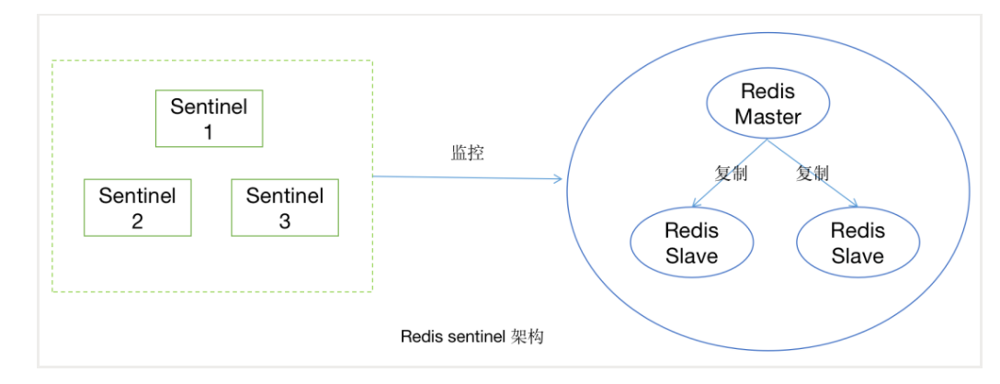

Redis 的主从复制模式下，一旦主节点由于故障不能提供服务，需要**手动将从节点晋升为主节点**，同时还要通知客户端更新主节点地址，这种故障处理方式从一定程度上是无法接受的。
<!--more-->

Redis 2.8 以后提供了 Redis Sentinel 哨兵机制来解决这个问题。

Redis Sentinel 是 Redis 高可用的实现方案。Sentinel 是一个管理**多个 Redis 实例的**工具，它可以实现对 Redis 的监控、通知、自动故障转移。

哨兵模式的主要作用在于它能够自动完成故障发现和故障转移，并通知客户端，从而实现高可用。哨兵模式通常由一组 Sentinel 节点和一组（或多组）主从复制节点组成。

心跳机制

（1）Sentinel与Redis Node

Redis Sentinel 是一个特殊的 Redis 节点。在哨兵模式创建时，需要通过配置指定 Sentinel 与 Redis Master Node 之间的关系，然后 Sentinel 会从主节点上获取所有从节点的信息，之后 Sentinel 会定时向主节点和从节点发送 info 命令获取其拓扑结构和状态信息。

（2）Sentinel与Sentinel

基于 Redis 的订阅发布功能， 每个 Sentinel 节点会向主节点的 sentinel：hello 频道上发送该 Sentinel 节点对于主节点的判断以及当前 Sentinel 节点的信息 ，同时每个 Sentinel 节点也会订阅该频道， 来获取其他 Sentinel 节点的信息以及它们对主节点的判断。

通过以上两步所有的 Sentinel 节点以及它们与所有的 Redis 节点之间都已经彼此感知到，之后每个 Sentinel 节点会向主节点、从节点、以及其余 Sentinel 节点定时发送 ping 命令作为心跳检测， 来确认这些节点是否可达。

故障转移

每个 Sentinel 都会定时进行心跳检查，当发现主节点出现心跳检测超时的情况时，此时认为该主节点已经不可用，这种判定称为主观下线。

之后该 Sentinel 节点会通过 sentinel ismaster-down-by-addr 命令向其他 Sentinel 节点询问对主节点的判断， 当 quorum（法定人数） 个 Sentinel 节点都认为该节点故障时，则执行客观下线，即认为该节点已经不可用。这也同时解释了为什么必须需要一组 Sentinel 节点，因为单个 Sentinel 节点很容易对故障状态做出误判。

这里 quorum 的值是我们在哨兵模式搭建时指定的，后文会有说明，通常为 Sentinel节点总数/2+1，即半数以上节点做出主观下线判断就可以执行客观下线。

因为故障转移的工作只需要一个 Sentinel 节点来完成，所以 Sentinel 节点之间会再做一次选举工作， 基于 Raft 算法选出一个 Sentinel 领导者来进行故障转移的工作。

被选举出的 Sentinel 领导者进行故障转移的具体步骤如下：

（1）在从节点列表中选出一个节点作为新的主节点

过滤不健康或者不满足要求的节点；
选择 slave-priority（优先级）最高的从节点， 如果存在则返回， 不存在则继续；
选择复制偏移量最大的从节点 ， 如果存在则返回， 不存在则继续；
选择 runid 最小的从节点。
（2）Sentinel 领导者节点会对选出来的从节点执行 slaveof no one 命令让其成为主节点。

（3）Sentinel 领导者节点会向剩余的从节点发送命令，让他们从新的主节点上复制数据。

（4）Sentinel 领导者会将原来的主节点更新为从节点， 并对其进行监控， 当其恢复后命令它去复制新的主节点。

#### Cluster部署

引入Cluster模式的原因：

不管是主从模式还是哨兵模式都只能由一个master在写数据，在海量数据高并发场景，一个节点写数据容易出现瓶颈，引入Cluster模式可以实现多个节点同时写数据。

Redis-Cluster采用无中心结构，每个节点都保存数据，节点之间互相连接从而知道整个集群状态。