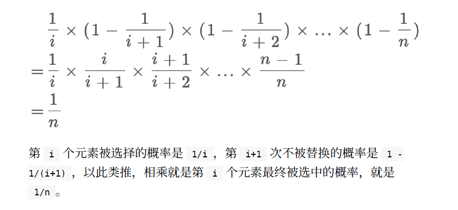

四种类型的随机抽样

* 未知长度的数组，只遍历一次，随机返回数组中任意一个数。 (随机指的是均匀随机)
* 未知长度的数组，只遍历一次，随机返回数组中任意k个数。 (随机指的是均匀随机)
* 已知长度的数组以及对应的权重，按照权重随机抽取索引
* 构造一个生成器类，构造函数传⼊⼀个很⻓的数组，请你实现randomGet ⽅法，每次调⽤随机返回数组中的⼀个元素，多次调⽤不能重复返回相同索引的元素。要求不能对该数组进⾏任何形式的修改，且操作的时间复杂度是 O(1)。
<!--more-->

#### 未知长度的数组，只遍历一次，随机返回数组中任意一个数。 (随机指的是均匀随机)
即长度为N，保证每个元素被抽中的概率是 1/N
结论:  当你遇到第 i 个元素时，应该有 1/i 的概率选择该元素， 1 - 1/i 的概率保持原有的选择。

#### 未知长度的数组，只遍历一次，随机返回数组中任意k个数。 (随机指的是均匀随机)

要随机选择 k 个数，只要在第 i 个元素处以 k/i 的概率选择该元素，以 1 - k/i 的概率保持原有选择   

因为虽然每次更新选择的概率增⼤了 k 倍，但是选到具体第 i 个元素的概率还是要乘 1/k ，也就回到了上⼀个推导。

#### 已知长度的数组以及对应的权重，按照权重随机抽取索引

* 线性扫描，大概过程是先计算出所有道具的权重总和S，然后调用随机函数得到一个区间在[0, S)的随机值，接着从头向后扫描道具列表，并不断从S减掉每个道具的权重值，当S小于某个道具的权重值时，这个道具就是抽中的那一个 复杂度在O(N)
* 先计算出总和列表，列表中每**个值是前面N个权重值的总和，**这样这个列表就是有序的，再对这个列表使用二分查找得到权重索引。复杂度是O(logN)